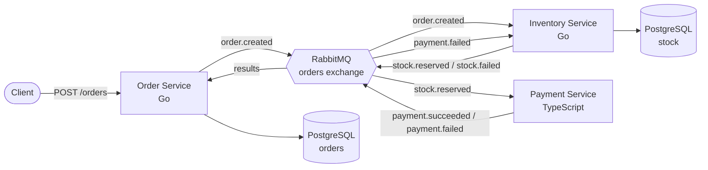

# Event-Driven E-Commerce (Microservices Demo)

A portfolio project demonstrating **microservices**, **event-driven architecture**, and the **Saga pattern** with compensating transactions — built with **Go**, **TypeScript**, and **RabbitMQ**.

---

## Overview

This system simulates an e-commerce order flow across multiple independent services that communicate **only through events** (RabbitMQ) — never by calling each other directly. It demonstrates a complete distributed transaction (Saga) that spans three services and two languages, including automatic rollback when a step fails.

---

## Architecture



---

## The Saga Flow

A single order triggers a multi-step distributed transaction:

```
order.created
   └─▶ Inventory reserves stock
         ├─ stock.reserved ─▶ Payment processes payment
         │                      ├─ payment.succeeded ─▶ Order status: PAID ✅
         │                      └─ payment.failed ─────▶ Order status: PAYMENT_FAILED ❌
         │                                              └─▶ Inventory RESTORES stock (compensation) 🔄
         └─ stock.failed ──────────────────────────────▶ Order status: FAILED ❌
```

**Key feature — compensating transactions:** if payment fails _after_ stock was reserved, the Inventory Service listens for `payment.failed` and automatically restores the stock, keeping the system consistent.

---

## Tech Stack

| Concern               | Technology                                |
| --------------------- | ----------------------------------------- |
| Services (Go)         | Order Service, Inventory Service          |
| Services (TypeScript) | Payment Service                           |
| Messaging             | RabbitMQ (topic exchange, durable queues) |
| Database              | PostgreSQL (database-per-service pattern) |
| Infrastructure        | Docker Compose                            |

---

## Services

| Service           | Language   | Port | Responsibility                                       |
| ----------------- | ---------- | ---- | ---------------------------------------------------- |
| Order Service     | Go         | 8081 | Creates orders, orchestrates the saga, tracks status |
| Inventory Service | Go         | —    | Reserves & restores stock (transaction-safe)         |
| Payment Service   | TypeScript | —    | Processes payments (simulated)                       |

---

## Messaging Design

All services communicate through a single RabbitMQ **topic exchange** (`orders`).

| Event               | Published by | Consumed by                     |
| ------------------- | ------------ | ------------------------------- |
| `order.created`     | Order        | Inventory                       |
| `stock.reserved`    | Inventory    | Payment, Order                  |
| `stock.failed`      | Inventory    | Order                           |
| `payment.succeeded` | Payment      | Order                           |
| `payment.failed`    | Payment      | Order, Inventory (compensation) |

---

## Getting Started

### Prerequisites

- Docker & Docker Compose
- Go 1.21+
- Node.js 20+

### 1. Start infrastructure (RabbitMQ + PostgreSQL)

```bash
docker compose up -d
```

RabbitMQ Management UI: http://localhost:15672 (guest / guest)

### 2. Create database tables

```bash
docker exec -it ecommerce-postgres psql -U postgres -d ecommerce
```

```sql
CREATE TABLE orders (
    id UUID PRIMARY KEY,
    product_id TEXT NOT NULL,
    quantity INT NOT NULL,
    status TEXT NOT NULL,
    created_at TIMESTAMPTZ NOT NULL DEFAULT now()
);

CREATE TABLE stock (
    product_id TEXT PRIMARY KEY,
    available INT NOT NULL
);

INSERT INTO stock (product_id, available) VALUES
    ('prod-123', 10),
    ('prod-456', 3);
```

### 3. Configure each service

Each service reads config from a `.env` file. Copy the examples:

```bash
cp services/order-service/.env.example services/order-service/.env
cp services/inventory-service/.env.example services/inventory-service/.env
cp services/payment-service/.env.example services/payment-service/.env
```

### 4. Run the services (each in its own terminal)

```bash
# Inventory Service
cd services/inventory-service && go run .

# Payment Service
cd services/payment-service && npm install && npm start

# Order Service
cd services/order-service && go run .
```

### 5. Place an order

```bash
# Successful order (small amount)
curl -X POST http://localhost:8081/orders \
  -H "Content-Type: application/json" \
  -d '{"product_id": "prod-123", "quantity": 3}'
```

Watch the logs flow across all three services as the saga completes.

---

## Try the Failure Paths

**Insufficient stock:**

```bash
curl -X POST http://localhost:8081/orders \
  -H "Content-Type: application/json" \
  -d '{"product_id": "prod-456", "quantity": 99}'
```

**Payment declined (amount > 100) — triggers stock compensation:**

```bash
curl -X POST http://localhost:8081/orders \
  -H "Content-Type: application/json" \
  -d '{"product_id": "prod-123", "quantity": 12}'
```

---

## Key Patterns Demonstrated

- **Event-driven architecture** — services are fully decoupled via RabbitMQ
- **Saga pattern** — multi-step distributed transaction with orchestration
- **Compensating transactions** — automatic rollback (stock restored on payment failure)
- **Database-per-service** — each service owns its data
- **Transaction-safe operations** — stock reservation uses row locking (`SELECT ... FOR UPDATE`) to prevent race conditions
- **Reliable messaging** — durable queues, persistent messages, manual acknowledgements
- **Cross-language interoperability** — Go and TypeScript services communicating seamlessly

---

## Status

✅ Core saga complete (order → stock → payment) with compensation.

**Planned next:**

- Notification Service (TypeScript)
- API Gateway with authentication
- Dead-letter queues & retry logic
- Observability (metrics, tracing)
- Full containerization of services
