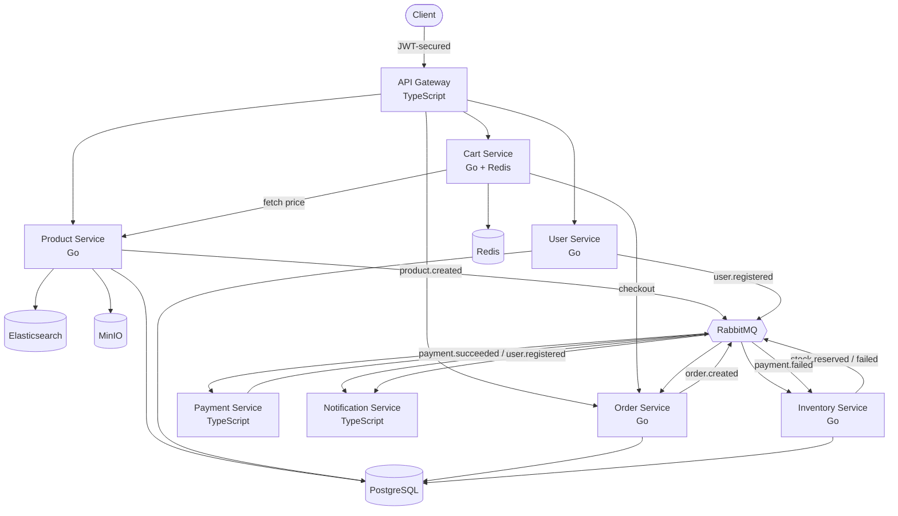

# Event-Driven E-Commerce Marketplace (Microservices)

A **Vinted-style second-hand marketplace backend** built with **microservices**, **event-driven architecture**, and the **Saga pattern** with compensating transactions. Sellers list unique items (with brand, size, condition, images), buyers browse, search, favorite, and check out — all through a secured API gateway.

Built with **Go**, **TypeScript**, **RabbitMQ**, **PostgreSQL**, **Redis**, **Elasticsearch**, and **MinIO** — fully containerized and started with a single command.

---

## Overview

This system models a real second-hand marketplace end-to-end, with **no manual setup**:

- Users register as buyers or sellers with **email verification** and optional **2FA (TOTP)**
- Sellers create listings with rich attributes (brand, size, color, condition, model code), **multiple images**, and **categories**; stock auto-registers via events
- Sellers manage their inventory: view their own listings, **pause/reactivate** items, and **soft-delete**
- Buyers **browse, search (typo-tolerant, filtered)**, **favorite** items, add to a cart, and check out
- Checkout triggers a distributed **Saga** across services, with **compensating transactions** on failure
- Admins manage a **dynamic category tree** at runtime
- All traffic flows through a secured **API Gateway** (JWT, RBAC, rate limiting)

Everything runs with: `docker compose up --build`

---

## Architecture



---

## Services

| Service              | Language   | Port | Responsibility                                                                     |
| -------------------- | ---------- | ---- | ---------------------------------------------------------------------------------- |
| API Gateway          | TypeScript | 8080 | Single entry point, JWT auth, RBAC, rate limiting, routing (http-proxy-middleware) |
| User Service         | Go         | 8082 | Registration, login, roles, email verification, **2FA (TOTP)**                     |
| Product Service      | Go         | 8083 | Listings, attributes, images, categories, search, favorites, status                |
| Cart Service         | Go         | 8084 | Shopping cart (Redis), price-safe checkout                                         |
| Order Service        | Go         | 8081 | Multi-item orders, saga orchestration, order history                               |
| Inventory Service    | Go         | —    | Atomic stock reservation, compensation, stock registration                         |
| Payment Service      | TypeScript | —    | Payment processing (simulated)                                                     |
| Notification Service | TypeScript | —    | Verification emails + order notifications                                          |

The five core Go services (User, Product, Cart, Order, Inventory) follow a **clean layered architecture** (domain / repository / service / handler) with dependency injection and interface-based abstractions.

---

## Infrastructure & Datastores (polyglot persistence)

| Technology        | Purpose                                                                 |
| ----------------- | ----------------------------------------------------------------------- |
| **PostgreSQL**    | Relational data (users, products, orders, categories, favorites, stock) |
| **Redis**         | Shopping carts (7-day TTL)                                              |
| **RabbitMQ**      | Event messaging (topic exchange, DLQ)                                   |
| **Elasticsearch** | Full-text product search (typo-tolerant, filtered)                      |
| **MinIO**         | S3-compatible object storage (product images)                           |

Each datastore is used for what it's best at — a deliberate polyglot-persistence design.

---

## Product Model (Vinted-style)

Each listing is a **unique second-hand item** with:

- Core: name, description, price, stock
- Attributes: **brand, model code, gender** (women/men/unisex/kids), **condition** (new with tags → satisfactory), **material, color, size**
- **Multiple images** (gallery, stored in MinIO, max configurable)
- **Category** (from a dynamic nested tree)
- **Status**: `active` / `inactive` (paused) / `deleted` (soft delete)

Prices are stored as integer cents internally (no float errors), accepted as dollars on input, and returned with a formatted display string.

---

## Key Flows

### Seller onboarding & listing

```
Register (seller) → verify email → login (JWT)
  → create listing (brand, size, condition, price...)
     → stock auto-registers in Inventory (via product.created event)
  → upload images (MinIO)
  → assign a category
  → manage: view own listings, pause/reactivate, soft-delete
```

### Buyer purchase (the Saga)

```
Register → verify → login (optional 2FA)
  → browse / search (typo-tolerant, filter by category/brand/condition/gender/price/seller)
  → favorite items ❤️
  → add to cart (real price fetched server-side — never trusts the client)
  → checkout → order.created
     → Inventory reserves ALL items (atomic, all-or-nothing)
        → Payment charges the total
           → success → Order PAID ✅
           → failure → Order PAYMENT_FAILED → Inventory RESTORES stock (compensation) 🔄
  → Notification sent → buyer views order history
```

---

## Search (Elasticsearch)

- **Full-text** search across product name, description, and **seller name** (find an influencer's shop)
- **Typo-tolerant** (fuzzy matching — "hodie" finds "hoodie")
- **Relevance ranking** (name weighted higher than description)
- **Faceted filters**: category, brand, condition, gender, price range
- Products auto-index on creation; de-index when paused/deleted, re-index when reactivated

Example:

```
GET /products/search?q=jumper&brand=Zara&condition=very_good&gender=women&max_price=5000
```

---

## Security

Layered defense, all at the gateway:

```
Helmet → Rate limiter → JWT auth → RBAC/ownership → proxy (with X-User-ID identity header)
```

- **JWT authentication** — gateway verifies credentials via the User Service, issues signed JWTs (bcrypt-hashed passwords)
- **Two-factor authentication (TOTP)** — compatible with Google Authenticator; password login returns `428` when 2FA is enabled, completed with a time-based code
- **Email verification** — unverified users can't log in
- **Token-based identity** — `buyer_id`/`seller_id` come from the verified JWT via an `X-User-ID` header, never from the request body
- **Ownership authorization** — sellers can only modify their own products (enforced in SQL)
- **Price-tampering protection** — the cart fetches real prices from the Product Service; client prices are ignored
- **RBAC** — buyer / seller / admin roles (PostgreSQL ENUM)

---

## Messaging Design (RabbitMQ)

A single topic exchange (`orders`) routes all events. Failed messages route to a **dead-letter queue** instead of being lost.

| Event               | Published by | Consumed by                                   |
| ------------------- | ------------ | --------------------------------------------- |
| `user.registered`   | User         | Notification                                  |
| `product.created`   | Product      | Inventory (registers stock)                   |
| `order.created`     | Order        | Inventory                                     |
| `stock.reserved`    | Inventory    | Payment, Order                                |
| `stock.failed`      | Inventory    | Order, Notification                           |
| `payment.succeeded` | Payment      | Order, Notification                           |
| `payment.failed`    | Payment      | Order, Inventory (compensation), Notification |

---

## Getting Started

### Prerequisites

- Docker & Docker Compose

### Run everything

```bash
docker compose up --build
```

Starts all 8 services + PostgreSQL, RabbitMQ, Redis, Elasticsearch, MinIO. Tables auto-create on first run.

### Dev tool dashboards

| Tool                | URL                    | Login                                                                          |
| ------------------- | ---------------------- | ------------------------------------------------------------------------------ |
| Adminer (Postgres)  | http://localhost:8090  | System: PostgreSQL, Server: `postgres`, User/Pass: `postgres`, DB: `ecommerce` |
| Redis Commander     | http://localhost:8091  | —                                                                              |
| Elasticvue (search) | http://localhost:8092  | connect to `http://localhost:9200`                                             |
| RabbitMQ            | http://localhost:15672 | `guest` / `guest`                                                              |
| MinIO (images)      | http://localhost:9001  | `minioadmin` / `minioadmin`                                                    |

---

## API (through the Gateway on :8080)

### Auth

```
POST /register                 Register (buyer/seller)
GET  /verify?token=...          Verify email
POST /login                     Login (returns JWT, or 428 if 2FA enabled)
POST /login/2fa                 Complete login with a 2FA code
POST /2fa/setup                 Generate a TOTP secret (QR)
POST /2fa/enable                Enable 2FA with a code
```

### Products

```
GET    /products                       Browse (active only)
GET    /products/search?q=...&...       Full-text + filtered search
GET    /products/mine                   Seller's own listings (incl. paused)
GET    /products/{id}                   Single product
POST   /products                        Create (seller)
PUT    /products/{id}                   Update (seller)
PATCH  /products/{id}/status            Activate / deactivate (seller)
DELETE /products/{id}                   Soft delete (seller)
POST   /products/{id}/images            Upload image (seller)
GET    /products/{id}/images            List images
DELETE /products/{id}/images/{imgId}    Delete image (seller)
```

### Favorites

```
GET    /favorites                Wishlist
POST   /favorites/{productId}    Add to favorites
DELETE /favorites/{productId}    Remove
```

### Cart & Orders

```
GET    /cart                     View cart
POST   /cart/items               Add item (price fetched server-side)
DELETE /cart/items/{productId}   Remove item
POST   /cart/checkout            Checkout (triggers the saga)
GET    /orders                   Order history
GET    /orders/{id}              Single order
```

### Categories & Admin

```
GET    /categories                     Browse the category tree (public)
POST   /admin/categories               Create category (admin)
PUT    /admin/categories/{id}          Rename/move (admin)
DELETE /admin/categories/{id}          Delete (admin, blocked if it has children)
```

---

## Testing

```bash
cd services/inventory-service && go test ./...   # Go: stock logic
cd services/payment-service && npm test          # TypeScript: payment logic
```

---

## Key Patterns & Concepts Demonstrated

- **Microservices** — 8 services, single-responsibility, database-per-service
- **Clean layered architecture** — domain/repository/service/handler, dependency inversion (5 Go services)
- **API Gateway** — unified secure entry (http-proxy-middleware) with custom middleware
- **Event-driven architecture** — decoupled services via RabbitMQ
- **Saga pattern** — multi-step distributed transaction with orchestration
- **Compensating transactions** — automatic stock restoration on payment failure
- **Event-driven data sync** — product creation auto-registers inventory stock
- **Fan-out / pub-sub** — multiple services react to the same event
- **Dead-letter queue** — poison messages quarantined
- **Full-text search** — Elasticsearch with fuzzy matching, relevance ranking, faceted filters
- **Object storage** — MinIO (S3-compatible) for image galleries
- **Polyglot persistence** — PostgreSQL, Redis, RabbitMQ, Elasticsearch, MinIO
- **Authentication & authorization** — JWT, RBAC, TOTP 2FA, email verification, token-based identity
- **Security-first design** — price-tampering protection, ownership enforcement
- **Dynamic configuration** — admin-managed nested category tree (adjacency list, cycle prevention)
- **Data lifecycle** — status management + soft delete
- **Correct money handling** — integer cents internally, decimals at the edges
- **Cross-language interoperability** — Go and TypeScript via language-agnostic events
- **Operability** — health checks, graceful shutdown, one-command startup, GUI dev tools

---

## Why Go and TypeScript?

Because services communicate through language-agnostic events, each uses the best-fit tool:

- **Go** — performance/concurrency-heavy core services (User, Product, Cart, Order, Inventory): goroutines, explicit errors, small static binaries.
- **TypeScript** — the gateway and integration services (Payment, Notification), where the Node ecosystem for web, auth, and SDKs is strongest.

This demonstrates a core benefit of event-driven microservices: **the right tool per service, interoperating seamlessly.**

---

## Project Structure

```
event-driven-ecommerce/
├── docker-compose.yml          # All services + infrastructure + dev tools
├── db/init.sql                 # Schema (auto-run on first start)
├── services/
│   ├── api-gateway/            # TypeScript — entry point + security
│   ├── user-service/           # Go — auth, users, verification, 2FA
│   ├── product-service/        # Go — listings, images, categories, search, favorites
│   ├── cart-service/           # Go + Redis — shopping cart
│   ├── order-service/          # Go — saga orchestration, order history
│   ├── inventory-service/      # Go — stock, compensation, registration
│   ├── payment-service/        # TypeScript — payments
│   └── notification-service/   # TypeScript — emails & notifications
└── rabbitmq-lab/               # Standalone RabbitMQ learning experiments
```

---

## Status

✅ Fully functional Vinted-style marketplace: seller onboarding & listing management (attributes, images, categories, pause/soft-delete) → buyer browse/search/favorite → cart → purchase saga with compensation → order history — all secured behind a unified API gateway, containerized, with no manual setup.

**Possible future work:**

- Follow sellers / seller profiles
- Make-an-offer (price negotiation)
- Admin-configurable settings & moderation
- Distributed tracing & metrics

```

```
