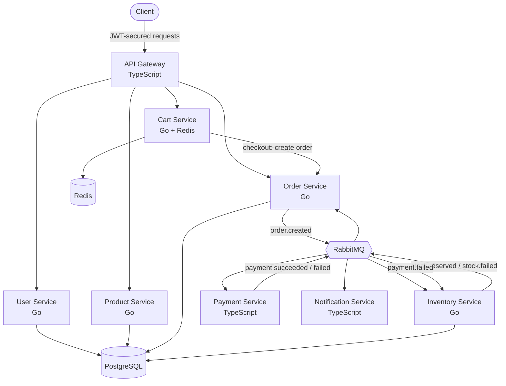

# Event-Driven E-Commerce Marketplace (Microservices)

A multi-vendor e-commerce **marketplace backend** built with **microservices**, **event-driven architecture**, and the **Saga pattern** with compensating transactions. Sellers list products, buyers add them to a cart and check out, and orders flow through a fully decoupled, resilient distributed system.

Built with **Go**, **TypeScript**, **RabbitMQ**, **PostgreSQL**, and **Redis** — fully containerized and started with a single command.

---

## Overview

This system models a real marketplace: users register as buyers or sellers, sellers manage a product catalog, buyers build a shopping cart and check out, and the purchase is processed by a multi-step distributed transaction (a Saga) spanning several services. All internal communication happens through **RabbitMQ events** — services never call each other directly (except synchronous, user-facing actions routed through the gateway).

Everything runs with: `docker compose up --build`

---

## Architecture



---

## Services

| Service              | Language   | Port | Responsibility                                  |
| -------------------- | ---------- | ---- | ----------------------------------------------- |
| API Gateway          | TypeScript | 8080 | Single entry point, security, JWT auth, routing |
| User Service         | Go         | 8082 | Registration, login, roles (bcrypt)             |
| Product Service      | Go         | 8083 | Product catalog, ownership-based authorization  |
| Cart Service         | Go         | 8084 | Shopping cart (Redis), checkout                 |
| Order Service        | Go         | 8081 | Multi-item orders, saga orchestration           |
| Inventory Service    | Go         | —    | Atomic stock reservation & compensation         |
| Payment Service      | TypeScript | —    | Payment processing (simulated)                  |
| Notification Service | TypeScript | —    | Order outcome notifications                     |

**Datastores:** PostgreSQL (users, products, orders, stock), Redis (carts), RabbitMQ (messaging).

---

## The Buy Flow (end to end)

```
Register (User Service)
  → Login → JWT issued by Gateway (verified via User Service)
  → Browse products (Product Service)
  → Add to cart (Cart Service, stored in Redis)
  → Checkout (Cart → Order Service)
      → order.created
        → Inventory reserves ALL items (atomic, all-or-nothing)
          → stock.reserved → Payment charges the total
            → payment.succeeded → Order PAID ✅
            → payment.failed → Order PAYMENT_FAILED ❌
                              → Inventory RESTORES stock (compensation) 🔄
          → stock.failed → Order FAILED ❌
  → Notification sent to the buyer
```

**Compensating transactions:** if payment fails after stock was reserved, the Inventory Service restores the stock automatically, keeping the system consistent.

**All-or-nothing reservation:** a multi-item order reserves every item inside a single database transaction — if any item is unavailable, the whole reservation rolls back and nothing is reserved.

---

## Security

All traffic flows through the API Gateway, which applies a layered security stack (defense in depth):

```
Request
  → Helmet (security headers)
  → Rate Limiter (per-IP, 429 on abuse)
  → JWT Authentication (401 if invalid)
  → RBAC / ownership checks (403 if not allowed)
  → Routed to the correct service
```

Key points:

- **Real JWT auth** — the Gateway verifies credentials via the User Service, then issues a signed JWT (bcrypt-hashed passwords, never stored in plain text).
- **Token-based identity** — for protected actions, the user's identity (`buyer_id` / `seller_id`) is taken from the verified JWT, **not** from the request body — so users cannot impersonate others.
- **Ownership authorization** — sellers can only modify their own products (enforced at the SQL layer).
- **RBAC** — role-based access (buyer / seller / admin) via a PostgreSQL ENUM.

---

## Messaging Design (RabbitMQ)

A single topic exchange (`orders`) routes all events. Failed/malformed messages are sent to a **dead-letter queue** instead of being lost.

| Event               | Published by | Consumed by                                   |
| ------------------- | ------------ | --------------------------------------------- |
| `order.created`     | Order        | Inventory                                     |
| `stock.reserved`    | Inventory    | Payment, Order                                |
| `stock.failed`      | Inventory    | Order, Notification                           |
| `payment.succeeded` | Payment      | Order, Notification                           |
| `payment.failed`    | Payment      | Order, Inventory (compensation), Notification |

---

## Getting Started

### Prerequisites

- Docker & Docker Compose

### Run everything

```bash
docker compose up --build
```

Starts all 8 services plus PostgreSQL, RabbitMQ, and Redis. Tables are auto-created on first run. RabbitMQ management UI: http://localhost:15672 (guest / guest).

---

## Usage (all through the Gateway on port 8080)

### 1. Register

```bash
curl -X POST http://localhost:8080/register \
  -H "Content-Type: application/json" \
  -d '{"email": "buyer@shop.com", "password": "secret123", "name": "Bob", "role": "buyer"}'
```

### 2. Login (get a JWT)

```bash
curl -X POST http://localhost:8080/login \
  -H "Content-Type: application/json" \
  -d '{"email": "buyer@shop.com", "password": "secret123"}'
```

### 3. Browse products (public)

```bash
curl http://localhost:8080/products
```

### 4. Add to cart (authenticated — buyer taken from the token)

```bash
curl -X POST http://localhost:8080/cart/items \
  -H "Authorization: Bearer <TOKEN>" \
  -H "Content-Type: application/json" \
  -d '{"product_id": "<PRODUCT_ID>", "quantity": 1, "price_cents": 4999}'
```

### 5. Checkout (triggers the full saga)

```bash
curl -X POST http://localhost:8080/cart/checkout \
  -H "Authorization: Bearer <TOKEN>"
```

Watch the logs as the order flows through Inventory → Payment → Notification.

---

## Testing

```bash
# Go tests (Inventory stock logic)
cd services/inventory-service && go test ./...

# TypeScript tests (Payment logic)
cd services/payment-service && npm test
```

---

## Key Patterns & Concepts Demonstrated

- **Microservices** — 8 independent services, single-responsibility, database-per-service
- **API Gateway** — unified secure entry point with layered middleware
- **Event-driven architecture** — decoupled services communicating via RabbitMQ
- **Saga pattern** — multi-step distributed transaction across services
- **Compensating transactions** — automatic rollback (stock restored on payment failure)
- **All-or-nothing atomicity** — multi-item reservation in a single DB transaction
- **Fan-out / pub-sub** — multiple services react to the same event
- **Dead-letter queue** — poison messages quarantined, not lost
- **Authentication & authorization** — JWT, RBAC, resource ownership, token-based identity
- **Transaction-safe operations** — row locking (`SELECT ... FOR UPDATE`) to prevent overselling
- **Reliable messaging** — durable queues, persistent messages, manual acks, redelivery
- **Polyglot persistence** — PostgreSQL, Redis, and RabbitMQ, each for its best use case
- **Cross-language interoperability** — Go and TypeScript services working together
- **Money as integer cents** — avoids floating-point errors
- **Operability** — health checks, graceful shutdown, containerized with one-command startup

---

## Why Go and TypeScript?

Because services communicate through language-agnostic events, each uses the best-fit tool:

- **Go** — performance-critical, concurrency-heavy core services (User, Product, Cart, Order, Inventory), where goroutines, explicit error handling, and small static binaries shine.
- **TypeScript** — the gateway and integration services (Payment, Notification), where the Node ecosystem for web, auth middleware, and third-party SDKs is strongest.

This demonstrates a core benefit of event-driven microservices: **the right tool per service, interoperating seamlessly.**

---

## Project Structure

```
event-driven-ecommerce/
├── docker-compose.yml          # Orchestrates all services + infra
├── db/init.sql                 # Database schema (auto-run on first start)
├── services/
│   ├── api-gateway/            # TypeScript — entry point + security
│   ├── user-service/           # Go — auth & users
│   ├── product-service/        # Go — catalog
│   ├── cart-service/           # Go + Redis — shopping cart
│   ├── order-service/          # Go — saga orchestration
│   ├── inventory-service/      # Go — stock + compensation
│   ├── payment-service/        # TypeScript — payments
│   └── notification-service/   # TypeScript — notifications
└── rabbitmq-lab/               # Standalone RabbitMQ learning experiments
```

---

## Status

✅ Fully functional marketplace: register → browse → cart → checkout → saga → confirmation, secured behind a unified API gateway, with compensation, dead-letter handling, tests, and one-command containerized startup.

**Possible future work:**

- Email confirmation & 2FA
- Product image uploads (object storage)
- Search & filtering
- Distributed tracing and metrics
