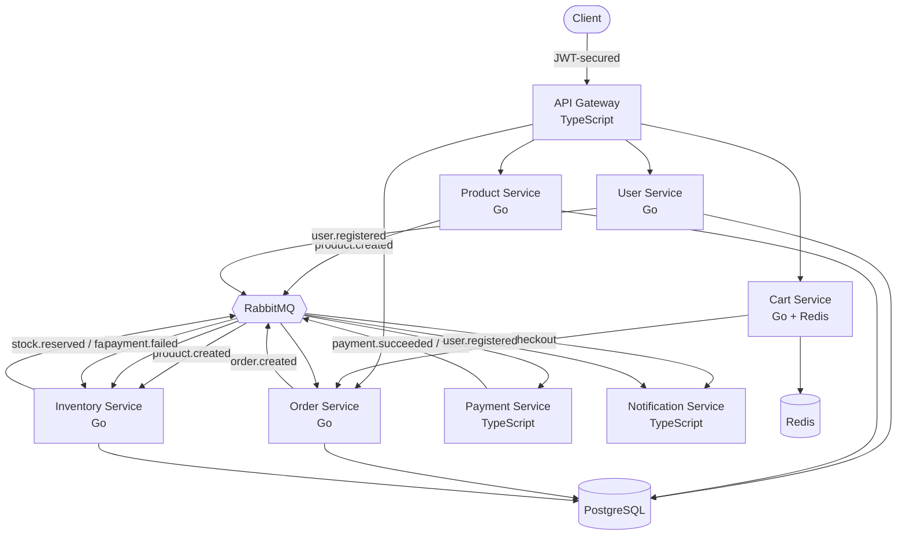

# Event-Driven E-Commerce Marketplace (Microservices)

A multi-vendor e-commerce **marketplace backend** built with **microservices**, **event-driven architecture**, and the **Saga pattern** with compensating transactions. Sellers register and list products, buyers browse, add to a cart, and check out — orders flow through a fully decoupled, resilient distributed system.

Built with **Go**, **TypeScript**, **RabbitMQ**, **PostgreSQL**, and **Redis** — fully containerized and started with a single command.

---

## Overview

This system models a real marketplace end-to-end, with **no manual setup**:

- Users register as buyers or sellers, with **email verification**
- Sellers create products; **stock auto-registers** in the inventory system via events
- Buyers browse, add items to a Redis-backed cart, and check out
- Checkout triggers a multi-step distributed transaction (a **Saga**) across services
- Failures are handled with **compensating transactions** (e.g. stock is restored if payment fails)
- All traffic flows through a secured **API Gateway** (JWT, RBAC, rate limiting)

Everything runs with: `docker compose up --build`

---

## Architecture



---

## Services

| Service              | Language   | Port | Responsibility                                                          |
| -------------------- | ---------- | ---- | ----------------------------------------------------------------------- |
| API Gateway          | TypeScript | 8080 | Single entry point, security, JWT auth, routing (http-proxy-middleware) |
| User Service         | Go         | 8082 | Registration, login, roles, email verification (bcrypt)                 |
| Product Service      | Go         | 8083 | Product catalog, ownership, decimal pricing                             |
| Cart Service         | Go         | 8084 | Shopping cart (Redis), price-safe checkout                              |
| Order Service        | Go         | 8081 | Multi-item orders, saga orchestration, order history                    |
| Inventory Service    | Go         | —    | Atomic stock reservation, compensation, stock registration              |
| Payment Service      | TypeScript | —    | Payment processing (simulated)                                          |
| Notification Service | TypeScript | —    | Verification emails + order notifications                               |

**Datastores:** PostgreSQL (users, products, orders, stock), Redis (carts), RabbitMQ (messaging).

Four core Go services (User, Product, Order, Inventory) follow a **clean layered architecture** (domain / repository / service / handler).

---

## Key Flows

### Seller onboarding & product creation

```
Register (seller) → email verification → login (JWT)
  → create product (price in dollars, e.g. 49.99)
     → product.created event
        → Inventory auto-registers the product's stock (no manual seeding)
```

### Buyer purchase (the Saga)

```
Register (buyer) → verify → login
  → browse products → add to cart (real price fetched server-side)
  → checkout → order.created
     → Inventory reserves ALL items (atomic, all-or-nothing)
        → stock.reserved → Payment charges the total
           → payment.succeeded → Order PAID ✅
           → payment.failed → Order PAYMENT_FAILED ❌
                             → Inventory RESTORES stock (compensation) 🔄
        → stock.failed → Order FAILED ❌
  → Notification sent → buyer views order history
```

**Compensating transactions:** if payment fails after stock was reserved, the Inventory Service restores stock automatically.

**All-or-nothing reservation:** a multi-item order reserves every item in a single DB transaction — if any item is unavailable, the whole reservation rolls back.

---

## Security

All traffic flows through the API Gateway, which applies a layered security stack (defense in depth):

```
Request
  → Helmet (security headers)
  → Rate Limiter (per-IP, 429 on abuse)
  → JWT Authentication (401 if invalid)
  → RBAC / ownership checks (403 if not allowed)
  → Proxied to the correct service (with X-User-ID identity header)
```

Highlights:

- **Real JWT auth** — the Gateway verifies credentials via the User Service, then issues a signed JWT (bcrypt-hashed passwords).
- **Email verification** — unverified users cannot log in (403).
- **Token-based identity** — for protected actions, identity (`buyer_id` / `seller_id`) comes from the verified JWT via an `X-User-ID` header, never from the request body. Users cannot impersonate others.
- **Ownership authorization** — sellers can only modify their own products (enforced in SQL).
- **Price-tampering protection** — the Cart Service fetches real prices from the Product Service; client-supplied prices are ignored.
- **RBAC** — role-based access (buyer / seller / admin) via a PostgreSQL ENUM.

---

## Money Handling

Prices are handled the professional way:

- **Stored internally as integer cents** (`price_cents`) to avoid floating-point errors
- **Accepted as dollars** on input (e.g. `"price": 49.99`)
- **Returned with a formatted display string** (e.g. `"price": "49.99"`)
- Conversion uses `math.Round` to prevent penny-loss rounding bugs

---

## Messaging Design (RabbitMQ)

A single topic exchange (`orders`) routes all events. Messages that fail processing (e.g. malformed payloads) are routed to a **dead-letter queue** instead of being lost.

| Event               | Published by | Consumed by                                   |
| ------------------- | ------------ | --------------------------------------------- |
| `user.registered`   | User         | Notification (sends verification email)       |
| `product.created`   | Product      | Inventory (registers stock)                   |
| `order.created`     | Order        | Inventory                                     |
| `stock.reserved`    | Inventory    | Payment, Order                                |
| `stock.failed`      | Inventory    | Order, Notification                           |
| `payment.succeeded` | Payment      | Order, Notification                           |
| `payment.failed`    | Payment      | Order, Inventory (compensation), Notification |

---

## Getting Started

### Prerequisites

- Docker & Docker Compose

### Run everything

```bash
docker compose up --build
```

Starts all 8 services plus PostgreSQL, RabbitMQ, and Redis. Tables are auto-created on first run. RabbitMQ management UI: http://localhost:15672 (guest / guest).

---

## Usage (all through the Gateway on port 8080)

### 1. Register (buyer or seller)

```bash
curl -X POST http://localhost:8080/register \
  -H "Content-Type: application/json" \
  -d '{"email": "seller@shop.com", "password": "secret123", "name": "Jane", "role": "seller"}'
```

### 2. Verify email

The verification link is logged by the Notification Service:

```bash
docker compose logs notification-service | grep verify | tail -1
```

```bash
curl "http://localhost:8082/verify?token=<TOKEN>"
```

### 3. Login (get a JWT)

```bash
curl -X POST http://localhost:8080/login \
  -H "Content-Type: application/json" \
  -d '{"email": "seller@shop.com", "password": "secret123"}'
```

### 4. Create a product (seller — price in dollars)

```bash
curl -X POST http://localhost:8080/products \
  -H "Authorization: Bearer <TOKEN>" \
  -H "Content-Type: application/json" \
  -d '{"name": "Blue Hoodie", "description": "Cozy", "price": 49.99, "stock": 20}'
```

Stock is auto-registered in the Inventory Service — no manual seeding.

### 5. Browse products (public)

```bash
curl http://localhost:8080/products
```

### 6. Add to cart (buyer — price fetched server-side)

```bash
curl -X POST http://localhost:8080/cart/items \
  -H "Authorization: Bearer <TOKEN>" \
  -H "Content-Type: application/json" \
  -d '{"product_id": "<PRODUCT_ID>", "quantity": 1}'
```

### 7. Checkout (triggers the saga)

```bash
curl -X POST http://localhost:8080/cart/checkout \
  -H "Authorization: Bearer <TOKEN>"
```

### 8. View order history

```bash
curl http://localhost:8080/orders \
  -H "Authorization: Bearer <TOKEN>"
```

---

## Testing

```bash
# Go tests (Inventory stock logic)
cd services/inventory-service && go test ./...

# TypeScript tests (Payment logic)
cd services/payment-service && npm test
```

---

## Key Patterns & Concepts Demonstrated

- **Microservices** — 8 independent services, single-responsibility, database-per-service
- **Clean layered architecture** — domain / repository / service / handler (with dependency inversion) in the core Go services
- **API Gateway** — unified secure entry point using `http-proxy-middleware`, with a custom middleware stack
- **Event-driven architecture** — decoupled services communicating via RabbitMQ
- **Saga pattern** — multi-step distributed transaction with orchestration
- **Compensating transactions** — automatic rollback (stock restored on payment failure)
- **Event-driven data sync** — product creation auto-registers inventory stock
- **Fan-out / pub-sub** — multiple services react to the same event
- **Dead-letter queue** — poison messages quarantined, not lost
- **Reliable messaging** — durable queues, persistent messages, manual acks, redelivery
- **Authentication & authorization** — JWT, RBAC, ownership, token-based identity, email verification
- **Security-first design** — price-tampering protection, no client-trusted identity
- **Transaction-safe operations** — row locking (`SELECT ... FOR UPDATE`) to prevent overselling
- **Correct money handling** — integer cents internally, decimals at the edges
- **Polyglot persistence** — PostgreSQL, Redis, RabbitMQ, each for its best use case
- **Cross-language interoperability** — Go and TypeScript services working together
- **Operability** — health checks, graceful shutdown, one-command containerized startup

---

## Why Go and TypeScript?

Because services communicate through language-agnostic events, each uses the best-fit tool:

- **Go** — performance-critical, concurrency-heavy core services (User, Product, Cart, Order, Inventory), where goroutines, explicit error handling, and small static binaries shine.
- **TypeScript** — the gateway and integration services (Payment, Notification), where the Node ecosystem for web, auth middleware, and third-party SDKs is strongest.

This demonstrates a core benefit of event-driven microservices: **the right tool per service, interoperating seamlessly.**

---

## Project Structure

```
event-driven-ecommerce/
├── docker-compose.yml          # Orchestrates all services + infrastructure
├── db/init.sql                 # Database schema (auto-run on first start)
├── services/
│   ├── api-gateway/            # TypeScript — entry point + security
│   ├── user-service/           # Go — auth, users, email verification
│   ├── product-service/        # Go — catalog, decimal pricing
│   ├── cart-service/           # Go + Redis — shopping cart
│   ├── order-service/          # Go — saga orchestration, order history
│   ├── inventory-service/      # Go — stock, compensation, registration
│   ├── payment-service/        # TypeScript — payments
│   └── notification-service/   # TypeScript — emails & notifications
└── rabbitmq-lab/               # Standalone RabbitMQ learning experiments
```

---

## Status

✅ Fully functional, self-contained marketplace: seller onboarding → product creation (auto stock registration) → buyer purchase saga with compensation → order history — all secured behind a unified API gateway, containerized, with no manual setup.

**Possible future work:**

- Product image uploads (object storage / MinIO)
- Product search & filtering
- Two-factor authentication
- Distributed tracing & metrics
