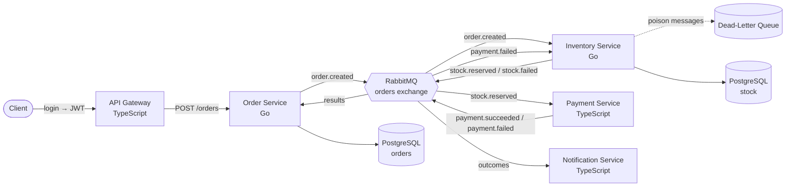

# Event-Driven E-Commerce (Microservices Demo)

A portfolio project demonstrating **microservices**, **event-driven architecture**, the **Saga pattern** with compensating transactions, a **secured API Gateway** (JWT + rate limiting + RBAC), and **dead-letter queues** — built with **Go**, **TypeScript**, and **RabbitMQ**, fully containerized with **Docker**.

---

## Overview

This system simulates an e-commerce order flow across multiple independent services that communicate **only through events** (RabbitMQ) — never by calling each other directly. It demonstrates a complete distributed transaction (Saga) spanning multiple services and two languages, including automatic rollback when a step fails, all secured behind an API Gateway with a layered security middleware stack.

The entire system runs with a single command: `docker compose up --build`.

---

## Architecture



---

## The Saga Flow

A single order triggers a multi-step distributed transaction:

```
order.created
   └─▶ Inventory reserves stock
         ├─ stock.reserved ─▶ Payment processes payment
         │                      ├─ payment.succeeded ─▶ Order status: PAID ✅
         │                      └─ payment.failed ─────▶ Order status: PAYMENT_FAILED ❌
         │                                              └─▶ Inventory RESTORES stock (compensation) 🔄
         └─ stock.failed ──────────────────────────────▶ Order status: FAILED ❌
```

**Key feature — compensating transactions:** if payment fails _after_ stock was reserved, the Inventory Service listens for `payment.failed` and automatically restores the stock, keeping the system consistent.

---

## API Gateway Security

All client traffic passes through the API Gateway, which applies a layered security middleware stack (defense in depth):

```
Request
  → Request Logger    📝  logs method, path, status, duration
  → Rate Limiter      🚦  blocks request floods (429 Too Many Requests)
  → Authentication    🔐  verifies JWT (401 if missing/invalid)
  → Authorization     👮  role-based access control (403 if wrong role)
  → Route handler
```

| Layer                  | Purpose                                               |
| ---------------------- | ----------------------------------------------------- |
| **Request Logging**    | Structured logging of every request for observability |
| **Rate Limiting**      | Sliding-window limit per IP to prevent abuse / DoS    |
| **JWT Authentication** | Verifies identity via signed tokens                   |
| **RBAC**               | Enforces permissions based on the user's role claim   |

**Authentication vs. Authorization:**

- `401 Unauthorized` — you're not logged in (no/invalid token)
- `403 Forbidden` — you're logged in, but not permitted for this action

---

## Tech Stack

| Concern               | Technology                                                   |
| --------------------- | ------------------------------------------------------------ |
| Services (Go)         | Order Service, Inventory Service                             |
| Services (TypeScript) | API Gateway, Payment Service, Notification Service           |
| Security              | JWT auth, rate limiting, RBAC middleware                     |
| Messaging             | RabbitMQ (topic exchange, durable queues, dead-letter queue) |
| Database              | PostgreSQL (database-per-service pattern)                    |
| Testing               | Go built-in testing, Node.js built-in test runner            |
| Infrastructure        | Docker & Docker Compose                                      |

---

## Services

| Service              | Language   | Port | Responsibility                                       |
| -------------------- | ---------- | ---- | ---------------------------------------------------- |
| API Gateway          | TypeScript | 8080 | Entry point, security middleware, request forwarding |
| Order Service        | Go         | 8081 | Creates orders, orchestrates the saga, tracks status |
| Inventory Service    | Go         | —    | Reserves & restores stock (transaction-safe)         |
| Payment Service      | TypeScript | —    | Processes payments (simulated)                       |
| Notification Service | TypeScript | —    | Sends notifications on order outcomes                |

---

## Messaging Design

All services communicate through a single RabbitMQ **topic exchange** (`orders`).

| Event               | Published by | Consumed by                                   |
| ------------------- | ------------ | --------------------------------------------- |
| `order.created`     | Order        | Inventory                                     |
| `stock.reserved`    | Inventory    | Payment, Order                                |
| `stock.failed`      | Inventory    | Order, Notification                           |
| `payment.succeeded` | Payment      | Order, Notification                           |
| `payment.failed`    | Payment      | Order, Inventory (compensation), Notification |

Messages that fail processing (e.g. malformed payloads) are routed to a **dead-letter queue** instead of being lost or blocking the consumer.

---

## Getting Started

### Prerequisites

- Docker & Docker Compose

### Run everything with one command

```bash
docker compose up --build
```

This starts:

- **RabbitMQ** (management UI at http://localhost:15672 — guest / guest)
- **PostgreSQL** (tables auto-created and seeded on first run)
- **API Gateway** (http://localhost:8080)
- **Order, Inventory, Payment, Notification services**

---

## Usage

The API Gateway secures all order requests with JWT authentication and RBAC.

### 1. Log in to get a token

Two demo accounts are available:

```bash
# Regular user
curl -X POST http://localhost:8080/login \
  -H "Content-Type: application/json" \
  -d '{"username": "user", "password": "password"}'

# Admin
curl -X POST http://localhost:8080/login \
  -H "Content-Type: application/json" \
  -d '{"username": "admin", "password": "password"}'
```

Response:

```json
{ "token": "eyJhbGciOiJIUzI1NiI..." }
```

### 2. Create an order (authenticated)

```bash
curl -X POST http://localhost:8080/orders \
  -H "Content-Type: application/json" \
  -H "Authorization: Bearer <YOUR_TOKEN>" \
  -d '{"product_id": "prod-123", "quantity": 2}'
```

### 3. Access an admin-only endpoint (RBAC)

```bash
curl http://localhost:8080/admin/stats \
  -H "Authorization: Bearer <TOKEN>"
```

- With an **admin** token → `200 OK`
- With a **user** token → `403 Forbidden`

---

## Try the Failure Paths

**Insufficient stock:**

```bash
curl -X POST http://localhost:8080/orders \
  -H "Content-Type: application/json" \
  -H "Authorization: Bearer <YOUR_TOKEN>" \
  -d '{"product_id": "prod-456", "quantity": 99}'
```

**Payment declined (amount > 100) — triggers stock compensation:**

```bash
curl -X POST http://localhost:8080/orders \
  -H "Content-Type: application/json" \
  -H "Authorization: Bearer <YOUR_TOKEN>" \
  -d '{"product_id": "prod-123", "quantity": 12}'
```

**Rate limiting** — send more than 5 requests within 10 seconds to receive `429 Too Many Requests`.

**Dead-letter queue** — publish a malformed message to the `orders` exchange (routing key `order.created`) via the RabbitMQ UI — it is routed to `inventory.events.dlq`.

---

## Testing

Unit tests cover core business logic in both languages.

```bash
# Go tests (Inventory Service)
cd services/inventory-service && go test ./...

# TypeScript tests (Payment Service)
cd services/payment-service && npm test
```

---

## Running Services Individually (development)

Each service can also be run directly (requires Go 1.27+ and Node.js 20+). Copy the `.env.example` in each service folder to `.env`, then:

```bash
cd services/order-service && go run .
cd services/inventory-service && go run .
cd services/payment-service && npm install && npm start
cd services/notification-service && npm install && npm start
cd services/api-gateway && npm install && npm start
```

---

## Key Patterns Demonstrated

- **API Gateway** — single entry point with a layered security middleware stack
- **Defense in depth** — logging, rate limiting, authentication, and authorization as composable middleware
- **JWT authentication + RBAC** — identity verification and role-based permissions
- **Event-driven architecture** — services are fully decoupled via RabbitMQ
- **Saga pattern** — multi-step distributed transaction with orchestration
- **Compensating transactions** — automatic rollback (stock restored on payment failure)
- **Fan-out / pub-sub** — multiple services independently consume the same events
- **Dead-letter queue** — poison messages are quarantined instead of lost
- **Database-per-service** — each service owns its data
- **Transaction-safe operations** — stock reservation uses row locking (`SELECT ... FOR UPDATE`)
- **Reliable messaging** — durable queues, persistent messages, manual acknowledgements
- **Cross-language interoperability** — Go and TypeScript services communicating seamlessly
- **Automated testing** — unit tests in both Go and TypeScript
- **Containerization** — the full system runs with a single `docker compose up`

---

## Why Go and TypeScript?

Because services communicate only through language-agnostic RabbitMQ events, each service uses the best-fit language for its job:

- **Go** — the performance-critical, concurrency-heavy core services (Order, Inventory), where goroutines, explicit error handling, and small static binaries shine.
- **TypeScript** — the I/O-bound integration services (API Gateway, Payment, Notification), where the Node ecosystem for web, auth middleware, and third-party SDKs (payment/notification providers) is strongest.

This demonstrates a core advantage of event-driven microservices: **teams can pick the right tool per service, and services in different languages interoperate seamlessly.**

---

## Status

✅ Fully functional: secured API gateway (JWT + rate limiting + RBAC) → order saga (stock → payment) → compensation + notifications, with dead-letter handling, automated tests, fully containerized.

**Planned next:**

- Security headers (helmet)
- CI pipeline (GitHub Actions)
- Health checks & graceful shutdown
- Observability (metrics, tracing)
