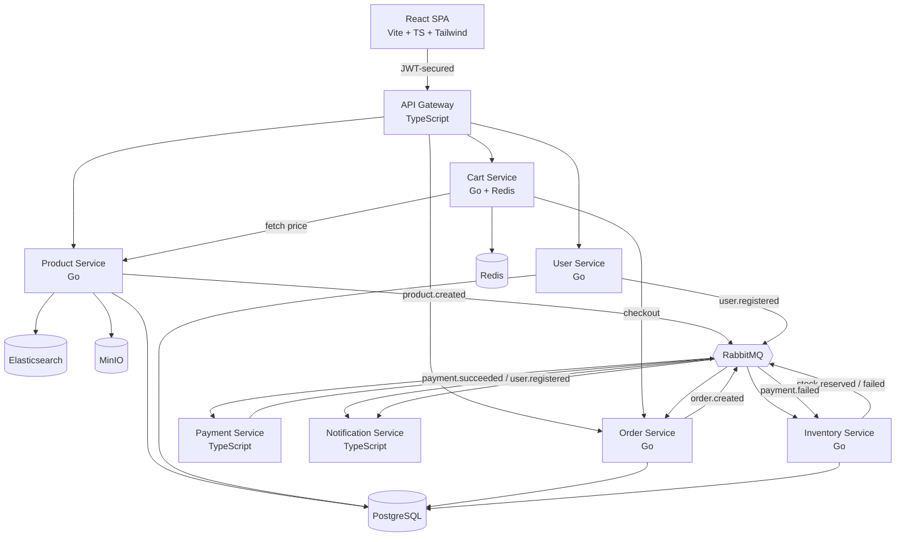

# Event-Driven E-Commerce Marketplace (Full-Stack Microservices)

A **Vinted-style second-hand marketplace** with a **React frontend** and an **event-driven microservices backend**, featuring the **Saga pattern** with compensating transactions. Sellers list unique items (brand, size, condition, images), buyers browse, search, favorite, and check out — all through a polished UI backed by a secured API gateway.

Built with **React + TypeScript** (frontend) and **Go**, **TypeScript**, **RabbitMQ**, **PostgreSQL**, **Redis**, **Elasticsearch**, and **MinIO** (backend) — fully containerized.

---

## Overview

A real second-hand marketplace, end-to-end, with **no manual setup**:

- Users register as buyers or sellers with **email verification** and optional **2FA (TOTP)**
- Sellers create listings with rich attributes (brand, size, color, condition, model code), **multiple images**, and **categories**; stock auto-registers via events
- Sellers manage inventory: view their own listings, **pause/reactivate**, **soft-delete**
- Buyers **browse, search (typo-tolerant, filtered)**, **favorite** items, add to cart, and check out
- Checkout triggers a distributed **Saga** across services, with **compensating transactions** on failure
- Admins manage a **dynamic category tree**, **runtime settings**, **users** (ban/roles), and view **platform analytics**
- A **React SPA** consumes everything through a secured API gateway

Backend: `docker compose up --build` · Frontend: `cd frontend && npm run dev`

---

## Architecture


```mermaid
flowchart TD
    UI[React SPA<br/>Vite + TS + Tailwind] -->|JWT-secured| Gateway[API Gateway<br/>TypeScript]

    Gateway --> User[User Service<br/>Go]
    Gateway --> Product[Product Service<br/>Go]
    Gateway --> Cart[Cart Service<br/>Go + Redis]
    Gateway --> Order[Order Service<br/>Go]

    Product --> PG[(PostgreSQL)]
    Product --> ES[(Elasticsearch)]
    Product --> Minio[(MinIO)]
    Product -->|product.created| RMQ{{RabbitMQ}}

    Cart -->|fetch price| Product
    Cart -->|checkout| Order

    Order -->|order.created| RMQ
    RMQ --> Inventory[Inventory Service<br/>Go]
    Inventory -->|stock.reserved / failed| RMQ
    RMQ --> Payment[Payment Service<br/>TypeScript]
    Payment -->|payment.succeeded / failed| RMQ
    RMQ --> Order
    RMQ -->|payment.failed| Inventory
    RMQ --> Notification[Notification Service<br/>TypeScript]

    User -->|user.registered| RMQ
    RMQ -->|user.registered| Notification

    User --> PG
    Order --> PG
    Inventory --> PG
    Cart --> Redis[(Redis)]
```

---

## Services

| Service              | Language   | Port | Responsibility                                                                       |
| -------------------- | ---------- | ---- | ------------------------------------------------------------------------------------ |
| Frontend             | React/TS   | 5173 | Buyer UI (browse, search, cart, checkout, favorites, orders, auth)                   |
| API Gateway          | TypeScript | 8080 | Entry point, JWT auth, RBAC, rate limiting, routing, API composition                 |
| User Service         | Go         | 8082 | Registration, login, roles, email verification, **2FA (TOTP)**, admin user mgmt      |
| Product Service      | Go         | 8083 | Listings, attributes, images, categories, search, favorites, status, settings, stats |
| Cart Service         | Go         | 8084 | Shopping cart (Redis), price-safe checkout                                           |
| Order Service        | Go         | 8081 | Multi-item orders, saga orchestration, order history, stats                          |
| Inventory Service    | Go         | —    | Atomic stock reservation, compensation, stock registration                           |
| Payment Service      | TypeScript | —    | Payment processing (simulated)                                                       |
| Notification Service | TypeScript | —    | Verification emails + order notifications                                            |

The five core Go services (User, Product, Cart, Order, Inventory) follow a **clean layered architecture** (domain / repository / service / handler) with dependency injection and interface-based abstractions.

---

## Infrastructure & Datastores (polyglot persistence)

| Technology        | Purpose                                                                           |
| ----------------- | --------------------------------------------------------------------------------- |
| **PostgreSQL**    | Relational data (users, products, orders, categories, favorites, settings, stock) |
| **Redis**         | Shopping carts (7-day TTL)                                                        |
| **RabbitMQ**      | Event messaging (topic exchange, DLQ)                                             |
| **Elasticsearch** | Full-text product search (typo-tolerant, filtered)                                |
| **MinIO**         | S3-compatible object storage (product images)                                     |

---

## Frontend

A **React single-page app** (Vite + TypeScript + Tailwind CSS) consuming the API gateway.

### Features

- **Browse** products in a responsive grid (paginated, lazy-loaded images)
- **Search** with debounced input → typo-tolerant Elasticsearch results
- **Product detail** with image gallery and full attributes
- **Favorites** ❤️ with optimistic updates + wishlist page
- **Cart & checkout** → triggers the full backend saga, with live order status
- **Order history** with color-coded statuses
- **Auth** — register, email verification, login, and **2FA (TOTP)**
- Polished UI — condition badges, hover effects, loading skeletons, toast notifications

### Engineering / scalability patterns

- **Pagination** — never loads the full catalog at once
- **TanStack Query** — caching, request deduplication, background refetching
- **Debounced search** — avoids an API call per keystroke
- **Lazy-loaded images** — load as they scroll into view
- **Optimistic UI** — instant feedback for favorites (reverts on error)
- **Auto-logout on 401** — clean handling of expired tokens
- **Static build** — deployable to any CDN
- **Clean architecture** — shared `Layout` (via `<Outlet />`), centralized route constants, organized folders

### Run the frontend

```bash
cd frontend
npm install
npm run dev     # http://localhost:5173
```

(The gateway has CORS enabled for the frontend origin.)

---

## Product Model (Vinted-style)

Each listing is a **unique second-hand item** with:

- Core: name, description, price, stock
- Attributes: **brand, model code, gender** (women/men/unisex/kids), **condition** (new with tags → satisfactory), **material, color, size**
- **Multiple images** (gallery, stored in MinIO, max configurable by admin)
- **Category** (from a dynamic nested tree)
- **Status**: `active` / `inactive` (paused) / `deleted` (soft delete)

Prices are stored as integer cents internally (no float errors), accepted as dollars on input, and returned with a formatted display string.

---

## Key Flows

### Seller

```
Register (seller) → verify email → login
  → create listing (brand, size, condition, price, images, category)
     → stock auto-registers in Inventory (via product.created event)
  → manage: view own listings, pause/reactivate, soft-delete
  → view stats (listings + favorites received)
```

### Buyer purchase (the Saga)

```
Register → verify → login (optional 2FA)
  → browse / search (typo-tolerant, filter by category/brand/condition/gender/price/seller)
  → favorite items ❤️
  → add to cart (real price fetched server-side — never trusts the client)
  → checkout → order.created
     → Inventory reserves ALL items (atomic, all-or-nothing)
        → Payment charges the total
           → success → Order PAID ✅
           → failure → Order PAYMENT_FAILED → Inventory RESTORES stock (compensation) 🔄
  → Notification sent → buyer views order history
```

---

## Search (Elasticsearch)

- **Full-text** across product name, description, and **seller name** (find a seller's shop)
- **Typo-tolerant** (fuzzy matching — "hodie" finds "hoodie")
- **Relevance ranking** (name weighted higher than description)
- **Faceted filters**: category, brand, condition, gender, price range
- Auto-indexed on creation; de-indexed when paused/deleted, re-indexed when reactivated

```
GET /products/search?q=jumper&brand=Zara&condition=very_good&gender=women&max_price=5000
```

---

## Security

Layered defense at the gateway:

```
CORS → Helmet → Rate limiter → JWT auth → RBAC/ownership → proxy (with X-User-ID identity header)
```

- **JWT authentication** — gateway verifies credentials via the User Service, issues signed JWTs (bcrypt-hashed passwords)
- **Two-factor authentication (TOTP)** — Google Authenticator compatible; password login returns `428` when 2FA is enabled, completed with a time-based code
- **Email verification** — unverified users can't log in
- **Token-based identity** — `buyer_id`/`seller_id` come from the verified JWT via an `X-User-ID` header, never from the request body
- **Ownership authorization** — sellers can only modify their own products (enforced in SQL)
- **Price-tampering protection** — the cart fetches real prices from the Product Service; client prices are ignored
- **RBAC** — buyer / seller / admin roles; admin endpoints gated; self-lockout prevention
- **User banning** — banned users blocked at login

---

## Admin Suite

- **Dynamic category tree** — nested categories managed at runtime (adjacency list, cycle prevention, delete protection)
- **Runtime settings** — e.g. `max_images_per_product` configurable without redeploy
- **User management** — list users, ban/reactivate, change roles (with self-lockout prevention)
- **Analytics dashboard** — platform-wide stats aggregated across services (**API composition pattern**): users by role, products by status, orders + revenue
- **Seller stats** — per-seller listings + favorites-received engagement

---

## Messaging Design (RabbitMQ)

A single topic exchange (`orders`) routes all events. Failed messages route to a **dead-letter queue**.

| Event               | Published by | Consumed by                                   |
| ------------------- | ------------ | --------------------------------------------- |
| `user.registered`   | User         | Notification                                  |
| `product.created`   | Product      | Inventory (registers stock)                   |
| `order.created`     | Order        | Inventory                                     |
| `stock.reserved`    | Inventory    | Payment, Order                                |
| `stock.failed`      | Inventory    | Order, Notification                           |
| `payment.succeeded` | Payment      | Order, Notification                           |
| `payment.failed`    | Payment      | Order, Inventory (compensation), Notification |

---

## Getting Started

### Prerequisites

- Docker & Docker Compose
- Node.js (for the frontend)

### Run the backend

```bash
docker compose up --build
```

Starts all backend services + PostgreSQL, RabbitMQ, Redis, Elasticsearch, MinIO, and dev-tool GUIs. Tables auto-create on first run.

### Run the frontend

```bash
cd frontend && npm install && npm run dev
```

### URLs & dev dashboards

| Tool                 | URL                    | Login                                                                          |
| -------------------- | ---------------------- | ------------------------------------------------------------------------------ |
| **Frontend (React)** | http://localhost:5173  | —                                                                              |
| API Gateway          | http://localhost:8080  | —                                                                              |
| Adminer (Postgres)   | http://localhost:8090  | System: PostgreSQL, Server: `postgres`, User/Pass: `postgres`, DB: `ecommerce` |
| Redis Commander      | http://localhost:8091  | —                                                                              |
| Elasticvue (search)  | http://localhost:8092  | connect to `http://localhost:9200`                                             |
| RabbitMQ             | http://localhost:15672 | `guest` / `guest`                                                              |
| MinIO (images)       | http://localhost:9001  | `minioadmin` / `minioadmin`                                                    |

---

## API (through the Gateway on :8080)

### Auth

```
POST /register                 Register (buyer/seller)
GET  /verify?token=...          Verify email
POST /login                     Login (returns JWT, or 428 if 2FA enabled)
POST /login/2fa                 Complete login with a 2FA code
POST /2fa/setup                 Generate a TOTP secret (QR)
POST /2fa/enable                Enable 2FA with a code
```

### Products

```
GET    /products?page=&limit=           Browse (active, paginated)
GET    /products/search?q=...&...        Full-text + filtered search
GET    /products/mine                    Seller's own listings (incl. paused)
GET    /products/{id}                    Single product
POST   /products                         Create (seller)
PUT    /products/{id}                     Update (seller)
PATCH  /products/{id}/status             Activate / deactivate (seller)
DELETE /products/{id}                    Soft delete (seller)
POST   /products/{id}/images             Upload image (seller)
GET    /products/{id}/images             List images
DELETE /products/{id}/images/{imgId}     Delete image (seller)
```

### Favorites

```
GET    /favorites                Wishlist
POST   /favorites/{productId}    Add to favorites
DELETE /favorites/{productId}    Remove
```

### Cart & Orders

```
GET    /cart                     View cart
POST   /cart/items               Add item (price fetched server-side)
DELETE /cart/items/{productId}   Remove item
POST   /cart/checkout            Checkout (triggers the saga)
GET    /orders                   Order history
GET    /orders/{id}              Single order
```

### Categories & Admin

```
GET    /categories                     Browse the category tree (public)
POST   /admin/categories               Create category (admin)
PUT    /admin/categories/{id}          Rename/move (admin)
DELETE /admin/categories/{id}          Delete (admin, blocked if it has children)
GET    /admin/settings                 List settings (admin)
PUT    /admin/settings/{key}           Update a setting (admin)
GET    /admin/users                    List users (admin)
PATCH  /admin/users/{id}/status        Ban/reactivate (admin)
PATCH  /admin/users/{id}/role          Change role (admin)
GET    /admin/stats                    Platform analytics (admin, aggregated)
GET    /seller/stats                   Seller's own stats
```

---

## Testing

```bash
cd services/inventory-service && go test ./...   # Go: stock logic
cd services/payment-service && npm test          # TypeScript: payment logic
```

---

## Key Patterns & Concepts Demonstrated

**Backend**

- **Microservices** — 8 services, single-responsibility, database-per-service
- **Clean layered architecture** — domain/repository/service/handler, dependency inversion
- **API Gateway** — unified secure entry (http-proxy-middleware) + **API composition** (aggregated admin stats)
- **Event-driven architecture** — decoupled services via RabbitMQ
- **Saga pattern** — multi-step distributed transaction with orchestration
- **Compensating transactions** — automatic stock restoration on payment failure
- **Event-driven data sync** — product creation auto-registers inventory stock
- **Fan-out / pub-sub**, **dead-letter queue**, durable/persistent messaging
- **Full-text search** — Elasticsearch (fuzzy, relevance, faceted filters)
- **Object storage** — MinIO (S3-compatible) image galleries
- **Polyglot persistence** — PostgreSQL, Redis, RabbitMQ, Elasticsearch, MinIO
- **AuthN/AuthZ** — JWT, RBAC, TOTP 2FA, email verification, token-based identity, banning
- **Security-first** — price-tampering protection, ownership enforcement, self-lockout prevention
- **Dynamic config** — admin-managed category tree + runtime settings
- **Data lifecycle** — status management + soft delete
- **Correct money handling** — integer cents internally, decimals at the edges
- **Cross-language interoperability** — Go and TypeScript via language-agnostic events

**Frontend**

- **React SPA** consuming the microservices
- **Scalable patterns** — pagination, query caching (TanStack Query), debounced search, lazy-loaded images, optimistic UI
- **Clean architecture** — Layout/Outlet, centralized routes, organized folders
- **Polished UX** — skeletons, toasts, condition badges, auto-logout on 401

---

## Why Go and TypeScript?

Because services communicate through language-agnostic events, each uses the best-fit tool:

- **Go** — performance/concurrency-heavy core services (goroutines, explicit errors, small static binaries)
- **TypeScript** — the gateway, integration services (Payment, Notification), and the React frontend (strong web/UI ecosystem)

The right tool per service, interoperating seamlessly.

---

## Project Structure

```
event-driven-ecommerce/
├── docker-compose.yml          # All services + infrastructure + dev tools
├── db/init.sql                 # Schema (auto-run on first start)
├── frontend/                   # React + TS + Tailwind SPA
│   └── src/
│       ├── api/                # axios client (JWT interceptor, auto-logout)
│       ├── auth/               # auth context
│       ├── cart/               # cart hook
│       ├── hooks/              # useFavorites, useDebounce
│       ├── components/         # ProductCard, FavoriteButton, Layout, skeletons
│       ├── pages/              # Products, ProductDetail, Cart, Orders, Favorites, Login, Verify
│       └── constants/routes.ts # centralized routes
├── services/
│   ├── api-gateway/            # TypeScript — entry point + security
│   ├── user-service/           # Go — auth, users, verification, 2FA, admin
│   ├── product-service/        # Go — listings, images, categories, search, favorites, settings
│   ├── cart-service/           # Go + Redis — shopping cart
│   ├── order-service/          # Go — saga orchestration, order history
│   ├── inventory-service/      # Go — stock, compensation, registration
│   ├── payment-service/        # TypeScript — payments
│   └── notification-service/   # TypeScript — emails & notifications
└── rabbitmq-lab/               # Standalone RabbitMQ learning experiments
```

---

## Status

✅ Fully functional, full-stack Vinted-style marketplace: React frontend (browse, search, favorites, cart, checkout, orders, auth with 2FA) on an event-driven microservices backend (saga with compensation, Elasticsearch search, MinIO images, dynamic categories, admin suite, analytics) — containerized, with no manual setup.

**Possible future work:**

- Seller listing UI (create/manage from the frontend)
- Admin dashboard UI
- Follow sellers / seller profiles
- Make-an-offer (price negotiation)
- Distributed tracing & metrics
- Real deployment (CDN for frontend, horizontal scaling for services)

```

```
