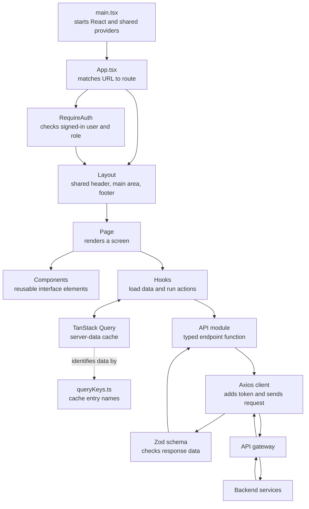

# Frontend Source Architecture

This document explains the code under `frontend/src`: what each folder is for, how the pieces fit together, and where to start when tracing a feature. For the broader frontend guide and verification details, see [frontend-architecture.md](frontend-architecture.md).

## Big Picture

The frontend is a React single-page application. React builds the screens in the browser. React Router selects a screen for the current URL. Pages use shared hooks to request or change backend data. API modules send those requests to the API gateway, and TanStack Query keeps server data cached between renders.



The boxes above describe responsibilities, not separate frontend servers. The frontend layers all run in the browser; the API gateway and backend services run separately.

## Source Tree

```text
frontend/src/
|-- main.tsx                 Application entry point and shared providers
|-- App.tsx                  URL-to-page routing and route groups
|-- api/                     HTTP endpoint functions, schemas, and query keys
|-- auth/                    Current user state and route access guard
|-- components/              Reusable UI, forms, and shared site layout
|   `-- layout/              Header/footer layout and route error boundary
|-- constants/               Route names and product display values
|-- hooks/                   Reusable server-data and feature behavior
|-- pages/                   Screens grouped by buyer, seller, admin, and static content
|-- test/                    Shared test setup and rendering helpers
|-- types/                   Shared TypeScript domain and API types
|-- utils/                   Small cross-feature helpers, such as error messages
|-- assets/                  Images and other bundled frontend assets
|-- index.css                Global styles and Tailwind entry point
`-- App.css                  App-level styles
```

### Entry and Routing

- `main.tsx` mounts React in the HTML root. It provides the shared TanStack Query client, browser router, authentication context, and toast notifications to the rest of the app.
- `App.tsx` maps route patterns from `constants/routes.ts` to page components. The layout is shared across screens. Less frequently visited pages are lazy-loaded so they do not all have to download before the home page renders.
- `auth/RequireAuth.tsx` prevents guests from entering signed-in routes and checks roles for admin routes. This improves navigation and user experience; it does not replace authorization in the gateway or backend.
- `components/layout/` contains the shared site frame and a route error boundary. The layout provides a loading fallback while a lazy page is downloaded and displays a recovery message if rendering that page fails.
- Unknown URLs are handled by the not-found route in `App.tsx`.

### Pages and Components

`pages/` contains URL-level screens. The top level contains buyer-facing screens such as browse, cart, orders, profile, and seller shop. `pages/seller/` contains listing creation, editing, and management. `pages/admin/` contains administration screens. `pages/static/` contains informational pages that share a common static-page component.

`components/` contains interface pieces used by one or more pages. Examples include `ProductCard`, `FavoriteButton`, `ProductForm`, and `ImageUploader`. Components can own temporary presentation state, but server-owned data should normally be loaded through a hook and the shared query cache.

### Hooks and Data Ownership

`hooks/` packages behavior that pages need:

- `useCart` loads the current user's cart and exposes add, remove, and checkout mutations.
- `useFavorites` loads and changes favorites only when a user is signed in.
- `useOrders` loads order history and polls while an order is still processing.
- `useCartProducts` loads product details needed to display cart lines.
- `useImageUpload` uploads selected files and keeps track of which files remain after a partial failure.
- `usePublicSettings` loads settings used by public-facing controls such as the image limit.
- `useDebounce` waits for input to settle before search requests are made.

There are two main kinds of state:

- **Server state** is data owned by the backend: products, a cart, favorites, or orders. TanStack Query fetches it, caches it, and refreshes it after mutations.
- **Local UI state** is short-lived state owned by a component: a form value, selected gallery image, or checkout confirmation. React state hooks manage it.

Keeping server state in one query cache avoids copying it into multiple components and helps the UI stay synchronized after changes.

### API Boundary and Types

`api/` separates HTTP details from pages:

- Domain files such as `cart.ts`, `orders.ts`, and `products.ts` define endpoint functions and response types.
- `client.ts` configures Axios with the API base URL, bearer-token attachment, and handling for unauthorized responses.
- `schemas.ts` uses Zod to check important untrusted JSON responses at runtime. TypeScript types alone do not validate data that arrives over HTTP.
- `queryKeys.ts` gives cached responses consistent names. Private keys include the user ID so two signed-in accounts do not share cart, favorites, or order data. Authentication changes remove cached private data.

`types/index.ts` defines shared domain types. Role, product-condition, and order-status types are derived from runtime schemas so compile-time values stay aligned with the values accepted at runtime. `constants/` holds shared route definitions and product display settings rather than request logic.

### Example: Loading the Cart

When someone opens `/cart`, React Router matches the URL in `App.tsx`. The authentication guard sends a guest to login and remembers the requested path. For a signed-in user, `CartPage` calls `useCart`. That hook calls `cartApi.get`, which sends the request through `client.ts`. The gateway returns JSON; `cart.ts` validates it with the cart schema; TanStack Query stores it under that user's cart key; and React renders the resulting cart data.

When checkout succeeds, `useCart` invalidates both the cart and order-history cache entries. `useOrders` then refreshes processing orders every two seconds and stops polling after every order reaches a terminal status.

## Tests

Tests live alongside their relevant source files as `*.test.ts` or `*.test.tsx`. They use Vitest, React Testing Library, and MSW to exercise user-visible behavior while intercepting HTTP requests. Shared setup and render helpers are in `src/test/`. Full browser-level login and checkout tests are in `frontend/e2e/`, outside `src/`, and use Playwright.
