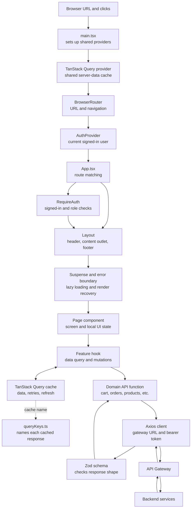

# Frontend Architecture and Change Log

This guide explains how the frontend is put together, how data moves through it, and where to look when following a feature. The frontend is a React single-page application built with TypeScript, Vite, React Router, TanStack Query, Axios, and Tailwind CSS.

## Start Here

If you are new to this code, it helps to read the frontend in this order:

1. `frontend/src/main.tsx` starts React and provides shared services to the app.
2. `frontend/src/App.tsx` matches the current URL to a page and applies route guards.
3. `frontend/src/pages/` contains the screens a person sees.
4. `frontend/src/hooks/` connects screens to server data and actions.
5. `frontend/src/api/` makes HTTP requests and checks important responses.

In other words, pages describe what to show, hooks describe what data or action a page needs, and API modules describe how that request reaches the backend.

### A Few Useful Terms

- **Component:** A reusable piece of the interface, such as a product card or site header.
- **Page:** A larger component associated with a URL, such as the cart or product details.
- **Hook:** A reusable function that lets a page use React features. Here, hooks also package data fetching and mutations, such as `useCart`.
- **API module:** A typed function that sends a request to the gateway, such as `cartApi.get`.
- **Server state:** Data owned by the backend, such as cart contents and orders. TanStack Query fetches and caches this data.
- **Local UI state:** Short-lived interface data owned by a component, such as the currently selected image or an open form. React's `useState` handles this.
- **Query key:** A structured name for one cached server response. If the key changes, TanStack Query treats it as a different response.
- **Mutation:** An action that changes backend data, such as removing an item or placing an order.

## Architecture at a Glance



Read the diagram in two parts. The top is how the app is assembled: `main.tsx` provides shared React contexts, then `App.tsx` chooses a route, and the shared layout hosts the screen. The bottom is how data is loaded: a page uses a feature hook, TanStack Query keeps that server data in a named cache entry, and an API function talks to the gateway.

The boxes are responsibilities, not separate servers. The browser, React components, hooks, cache, API modules, and Zod checks all run in the frontend. The gateway and backend services are separate processes.

## How a Screen Gets on the Page

`frontend/src/main.tsx` is the frontend's entry point. It mounts React and wraps the app in shared providers:

- `QueryClientProvider` makes the server-data cache available to hooks.
- `BrowserRouter` makes the current URL and navigation available to routes.
- `AuthProvider` makes the current user, login, and logout functions available to components.
- `Toaster` provides app-wide notification messages.

`frontend/src/App.tsx` maps URLs to pages. `Layout` is shared, so its header and footer remain in place as the page changes. Less frequently used pages are loaded only when visited. `RequireAuth` checks whether the user can enter a route; it sends guests to login and blocks users whose role is insufficient. The backend still repeats these checks when it receives API requests.

Inside a page, component state is for temporary presentation choices. For example, the cart page keeps the just-placed order message in local state. The cart itself comes from the backend and belongs in the query cache instead. Keeping those two kinds of state separate prevents server data from being copied into multiple components and becoming inconsistent.

## Example: Login, Cart, and Checkout

This is the path to follow when someone opens the cart and checks out:

1. The cart URL matches the protected route in `frontend/src/App.tsx`. If the person is signed out, `RequireAuth` saves the requested path and sends them to login.
2. `LoginPage` posts credentials through the Axios client. The response token is checked with the login schema, then `AuthProvider` decodes and validates the claims for frontend display and navigation.
3. After login, the app returns to the requested cart URL. `CartPage` calls `useCart` to get cart contents and provides the checkout action.
4. `useCart` calls `cartApi.get`. The API module sends the request through Axios, which attaches the token; the returned JSON is validated by the cart schema.
5. TanStack Query stores the cart under a key containing the user's ID. This lets a different account have a separate cart cache.
6. On checkout, `cartApi.checkout` submits the mutation and validates the returned order. The hook refreshes the cart and order-history queries.
7. On the Orders page, `useOrders` refreshes every two seconds while the order is still `pending` or `stock_reserved`. Polling stops once the status becomes terminal.

The frontend starts the request and presents its result. The gateway and backend services own the purchase workflow and saga; frontend success messages alone don't determine whether payment or stock reservation succeeded.

The frontend guards provide navigation and user experience, not authorization. The gateway and services must continue to enforce authentication, roles, and ownership independently.

## Source Map

| Area                           | Location                          | Responsibility                                                                                                                                                  |
| ------------------------------ | --------------------------------- | --------------------------------------------------------------------------------------------------------------------------------------------------------------- |
| Application and routes         | `frontend/src/App.tsx`            | Route tree, shared layout, protected route groups, lazy page imports, and not-found view.                                                                       |
| Shared layout and route errors | `frontend/src/components/layout/` | Site chrome, lazy-route loading fallback, and a route-scoped React error boundary.                                                                              |
| Authentication                 | `frontend/src/auth/`              | Parse JWT claims for UI state, reject malformed or expired tokens, and guard protected pages. JWT verification is performed by the backend, not in the browser. |
| API transport                  | `frontend/src/api/client.ts`      | Axios base URL, token header, and 401 handling.                                                                                                                 |
| Endpoint modules               | `frontend/src/api/`               | Typed request functions grouped by domain.                                                                                                                      |
| Runtime contracts              | `frontend/src/api/schemas.ts`     | Zod schemas for auth claims, roles, product conditions, products, profiles, carts, and orders.                                                                  |
| Query keys                     | `frontend/src/api/queryKeys.ts`   | Shared keys and listing-query invalidation rules.                                                                                                               |
| Feature hooks                  | `frontend/src/hooks/`             | Server state and operations for cart, favorites, orders, uploads, and settings.                                                                                 |
| Domain types                   | `frontend/src/types/index.ts`     | Types inferred from domain schemas and shared API entities.                                                                                                     |
| Unit and integration tests     | `frontend/src/**/*.test.{ts,tsx}` | Vitest, jsdom, React Testing Library, and MSW behavior coverage.                                                                                                |
| Browser tests                  | `frontend/e2e/`                   | Playwright login and checkout workflows using an intercepted API.                                                                                               |

## Request and State Flow

1. A page or feature hook requests data through a domain API module.
2. TanStack Query runs the request and stores the result under a key from `queryKeys`.
3. Axios attaches the saved bearer token. The API module parses important responses with a Zod schema before exposing them to components.
4. Mutations invalidate related keys. Checkout invalidates both the current user's cart and orders.
5. Orders are polled every two seconds while any order is `pending` or `stock_reserved`. Polling stops when all observed orders reach a terminal status, or when a request fails.

Private query keys share a `private` prefix and include the authenticated user ID, for example:

```text
['private', userId, 'cart']
['private', userId, 'favorites']
['private', userId, 'orders']
['private', userId, 'my-products']
```

Login and logout cancel and remove cached queries with that prefix. This prevents old-account data from rendering after an account switch. Public product, category, profile, and setting data use separate keys.

## Route and Access Model

- Public routes include browse, product details, login, verification, informational pages, and public seller shops.
- `RequireAuth` protects the cart, orders, favorites, seller listing management, editing, and profile routes.
- `RequireAuth` with the `admin` role protects dashboard, user, category, and settings administration.
- An unauthenticated user is sent to login with the requested local path in router state; successful login returns them there. External redirect targets are rejected.
- Unknown paths render a not-found page.
- Secondary pages are imported with `React.lazy` and rendered inside `Suspense` and the route error boundary. A failed page render or import shows a recovery view while preserving the shared layout.

Role and auth claims are runtime-checked. The browser only decodes JWT claims to tailor the interface; decoded claims are not trusted as server authorization.

## Reliability Improvements

- Guest product cards no longer issue private favorites requests unless there is an authenticated user.
- Private query cache is scoped to an account and cleared on auth transitions.
- Cart, favorites, profile, and orders distinguish errors from empty/loading states and expose retry actions where appropriate.
- API responses for login, products, profiles, cart, and orders are validated at the client boundary. Invalid status values and malformed payloads reject instead of silently entering application state.
- Product creation and editing preserve the successful write if a later image upload fails. The seller can retry only the remaining files without creating the listing or repeating the product update. Related listing, shop, and favorite caches are invalidated after the write attempt.
- Image previews allocate object URLs in an effect and revoke them during cleanup.
- Strict TypeScript is enabled for application code and frontend tooling; role, order-status, and product-condition unions are tied to runtime schemas.

## Verification

Run these commands from `frontend/`:

```bash
npm ci
npm run build
npm run lint
npm test
npx playwright install chromium
npm run test:e2e
```

`npm test` runs Vitest with React Testing Library and MSW. The suite covers guest browsing, private-request gating, account switching, query failures, malformed API responses, resumable create/edit image uploads, route guards, not-found handling, route error recovery, checkout invalidation, and saga polling.

`npm run test:e2e` starts an isolated Vite server on `127.0.0.1:5179` and runs login and checkout flows on desktop and mobile Chromium. The browser tests intercept API traffic; they do not verify a running API gateway, database, payment service, RabbitMQ delivery, or a real end-to-end saga. Install the Playwright browser once locally and in fresh CI environments. Ensure port 5179 is available.

## Runtime Configuration

`VITE_API_URL` sets the API gateway URL; it defaults to `http://localhost:8080`. The frontend dev server uses Vite's default port unless overridden. The Playwright configuration intentionally uses a separate strict port so it does not attach to a developer's existing server.

## Not Covered by the Frontend Changes

- Server-side JWT validation, role checks, seller ownership enforcement, and service-to-service identity.
- Distributed transaction correctness, payment authorization, inventory compensation, notification delivery, and persistence.
- End-to-end integration against live backend services. Current browser tests use deterministic mocked responses.
- Server-side rendering. The application is a client-rendered SPA.
